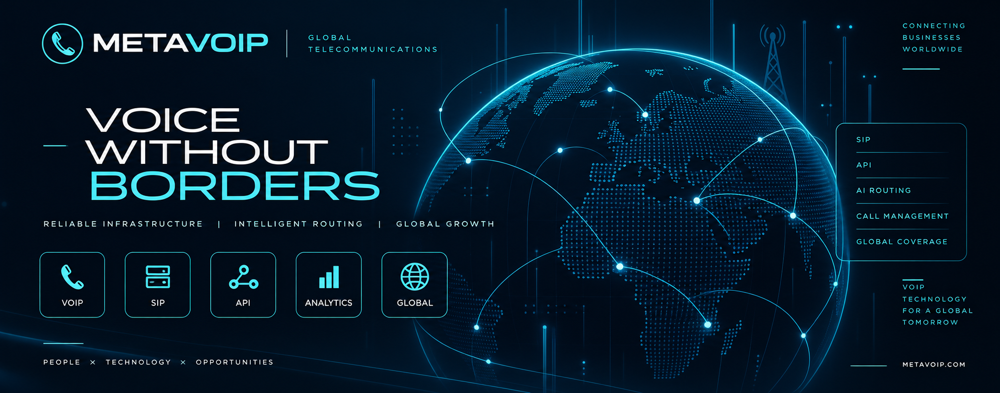

<p align="center">
  
  
  
  
  
  
</p>

# MetaVoIP

### Global VoIP & Telecommunications Infrastructure

**Reliable voice. Intelligent routing. Global connectivity.**

MetaVoIP provides telecommunications and VoIP technologies designed to help businesses build, manage and scale modern communication infrastructure.

---

## 🌐 About MetaVoIP

MetaVoIP is a global telecommunications technology platform built around **VoIP infrastructure, intelligent routing and business communication**.

We connect voice infrastructure, automation and integrations to help businesses manage communication at scale.

### What we focus on

- **Voice Infrastructure** — reliable and scalable VoIP connectivity
- **Intelligent Routing** — flexible call routing and traffic management
- **Automation** — streamlined communication workflows
- **Integrations** — connecting telephony with business systems
- **Analytics** — visibility into communication performance
- **Global Connectivity** — infrastructure for international operations
  
---

## ⚡ What We Build

### 📞 VoIP Infrastructure
Scalable voice communication infrastructure for modern business needs.

### 🔀 Intelligent Call Routing
Flexible call routing and traffic management designed for different business workflows.

### 🤖 Communication Automation
Automation technologies that help businesses manage repetitive communication processes.

### 🔗 API Integrations
Connect telephony infrastructure with CRM systems, business platforms and custom applications.

### 📊 Call Management
Tools and technologies for managing, monitoring and analyzing business communication.

### 🌍 Global Connectivity
Voice infrastructure designed to support communication across international markets.

---

## 🛠 Core Capabilities

- VoIP & SIP technologies
- Call routing
- Voice traffic management
- Telephony infrastructure
- API integrations
- CRM integrations
- Communication automation
- Call analytics
- AI-powered communication
- Scalable telecom architecture

---

## 💼 Business Solutions

MetaVoIP technologies can support a wide range of business communication workflows:

- Sales teams
- Customer support
- Lead qualification
- Contact centers
- Customer communication
- International operations
- High-volume calling
- Business process automation

---

## 🔌 Integrations

MetaVoIP can be integrated with business systems to create connected communication workflows.

Typical integrations include:

**CRM → Telephony → Call Routing → AI / Automation → Analytics**

---

## 🧠 Technology

Our technology stack is focused on building flexible and scalable communication infrastructure.

### Key technology areas

`VoIP` · `SIP` · `APIs` · `Call Routing` · `Telephony` · `Automation` · `AI` · `CRM` · `Analytics`

---

## 🚀 Built for Scale

Modern businesses need communication infrastructure that can adapt as they grow.

MetaVoIP focuses on:

- Scalability
- Reliability
- Flexible routing
- Automation
- System integrations
- Global communication
- Efficient infrastructure management

---

## 🌐 Our Ecosystem

MetaVoIP brings together communication infrastructure, routing, automation and business integrations into a connected technology ecosystem.

```text
                    META VOIP
                        │
        ┌───────────────┼───────────────┐
        │               │               │
     TELEPHONY       ROUTING        AUTOMATION
        │               │               │
        └───────────────┼───────────────┘
                        │
                   INTEGRATIONS
                        │
              ┌─────────┼─────────┐
              │         │         │
             CRM       AI      ANALYTICS
